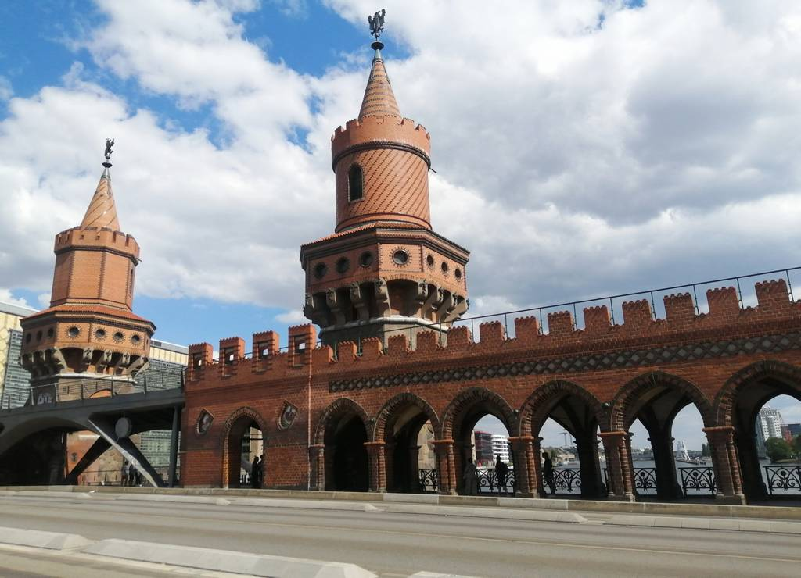

# Berlin / Alemania 

## Descripción 
Berlín es una ciudad histórica y vibrante que combina historia del siglo XX con modernidad.

## Recomendación 
Imprescindibles son la Puerta de Brandeburgo, el Monumento al Holocausto, el Reichstag y los restos del muro en la East Side Gallery. Se recomiendan de 3 a 4 días, alojarse cerca de Alexanderplatz para facilitar el transporte y usar el metro (U-Bahn/S-Bahn).

## Imagen de Berlin 

## Información de Berlin 
Berlín, capital de Alemania, es la ciudad más poblada del país (aprox. 3.77 millones) y un centro cultural y político clave en Europa. Famosa por su historia intensa, incluyendo la Segunda Guerra Mundial y la división por el Muro (1961-1989), hoy destaca por su contraste entre arquitectura moderna, museos y una vibrante cultura alternativa.