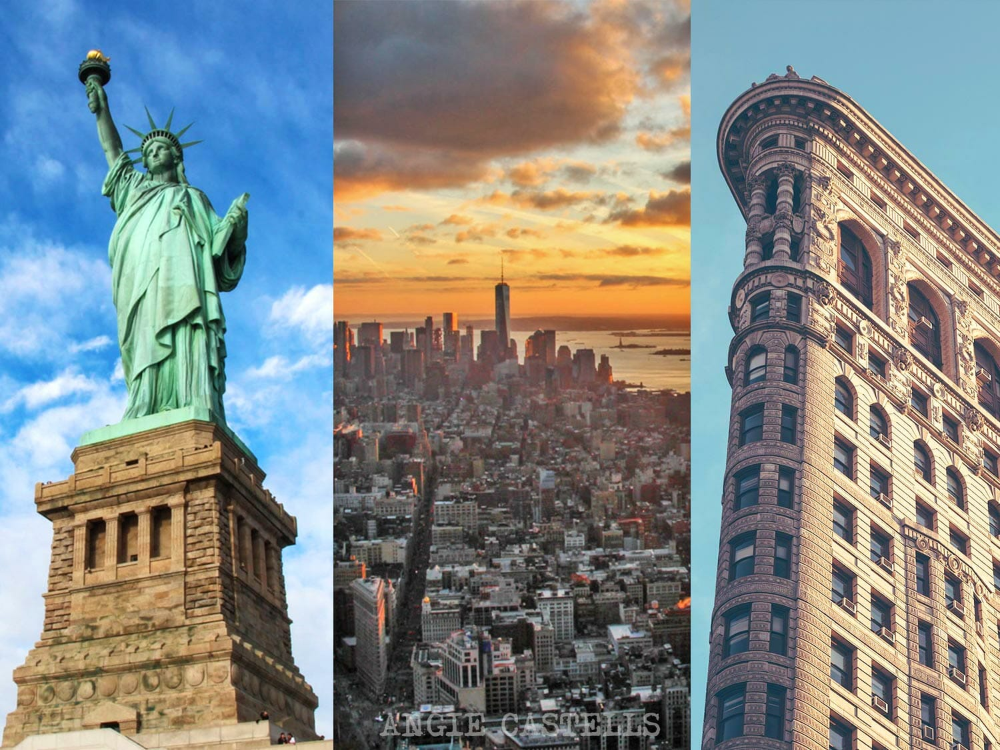

# Nueva York / EE.UU

## Descripción 
Nueva York (NYC) es la ciudad más poblada y vibrante de Estados Unidos, un centro mundial de finanzas, cultura y arte conocido como "la Gran Manzana". Famosa por su icónico skyline con rascacielos como el Empire State, alberga lugares icónicos como Times Square, Central Park y la Estatua de la Libertad. 

## Recomendación 
Para un viaje inolvidable a Nueva York, prioriza caminar por Central Park, cruzar el Puente de Brooklyn al atardecer y subir a un mirador como el Top of the Rock para obtener las mejores vistas. Explora barrios como Greenwich Village, disfruta de un musical en Broadway y usa el metro para moverte.

## Foto de Nueva York

## Información 

Características Principales:
- Geografía: Situada en la desembocadura del río Hudson, está formada principalmente por islas (Manhattan, Staten Island y parte de Long Island).
- Economía y Finanzas: Considerada la capital financiera mundial, con Wall Street y un impacto masivo en el comercio internacional.
- Cultura y Turismo: Alberga museos de clase mundial, teatros en Broadway, y una inmensa variedad étnica (más de 200 idiomas).
- Símbolos: La Estatua de la Libertad, el Empire State Building, el Puente de Brooklyn y el World Trade Center.

Distritos:
- Manhattan: Corazón financiero y turístico.
- Brooklyn: Conocido por su ambiente artístico y residencial.
- Queens: Diversidad étnica y hogar de aeropuertos internacionales.
- El Bronx: Cuna del hip-hop y el estadio de los Yankees.
- Staten Island: Suburbano y con vistas a la bahía. 

La ciudad se caracteriza por un ritmo de vida rápido, un alto costo de vida, pero con una inigualable oferta de entretenimiento, gastronomía y oportunidades.