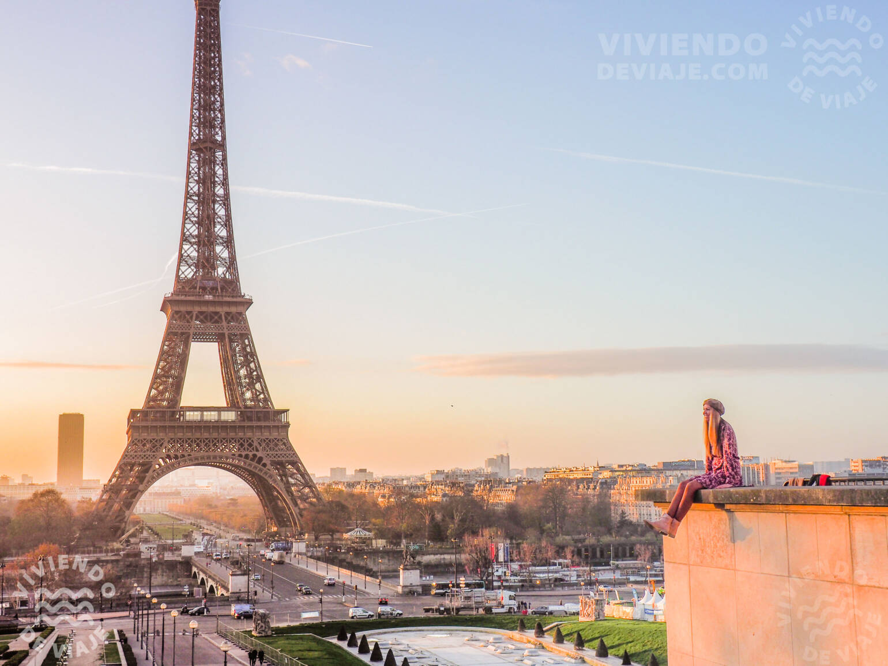

# Paris / Francia

 ## Descripción
 París, capital de Francia y apodada la "Ciudad de la Luz", es un centro mundial de arte, moda, gastronomía y cultura situado a orillas del río Sena. Reconocida por su arquitectura icónica como la Torre Eiffel y el Museo del Louvre, destaca por su influencia histórica desde la Ilustración hasta la Belle Époque. Es una de las ciudades más visitadas y románticas del mundo.

## Recomendación
 Imprescindible visitar la Torre Eiffel, el Museo del Louvre, pasear por Montmartre y navegar por el Sena. Se recomienda encarecidamente reservar entradas con antelación para evitar largas filas en los monumentos.

 ## Foto de Paris
 

 