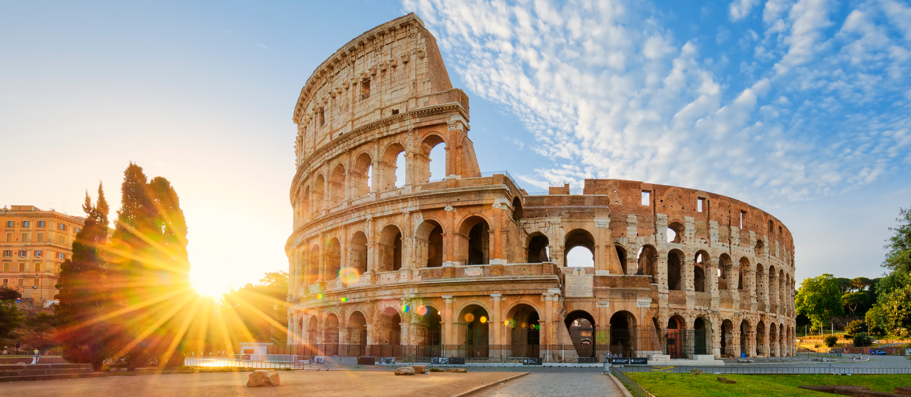

# Roma / Italia

## Descripción 
Roma es un destino inigualable que combina historia antigua, arte y cultura gastronómica.

## Recomendación 
Para aprovecharla al máximo, se recomienda visitar el Coliseo, el Foro Romano y los Museos Vaticanos con entradas compradas con antelación. La mejor época es primavera o otoño para evitar el calor extremo, y alojarse en el centro histórico facilita recorrer la ciudad a pie.

## Imagen de Roma 

## Información 

Roma, conocida como la "Ciudad Eterna", es la capital de Italia y de la región del Lacio, situada en el centro-oeste de la península a orillas del río Tíber. Con más de 2,7 millones de habitantes, es una de las ciudades con mayor concentración de bienes históricos y arquitectónicos del mundo, destacando su centro histórico, el Coliseo y el Vaticano como Patrimonio de la Humanidad.