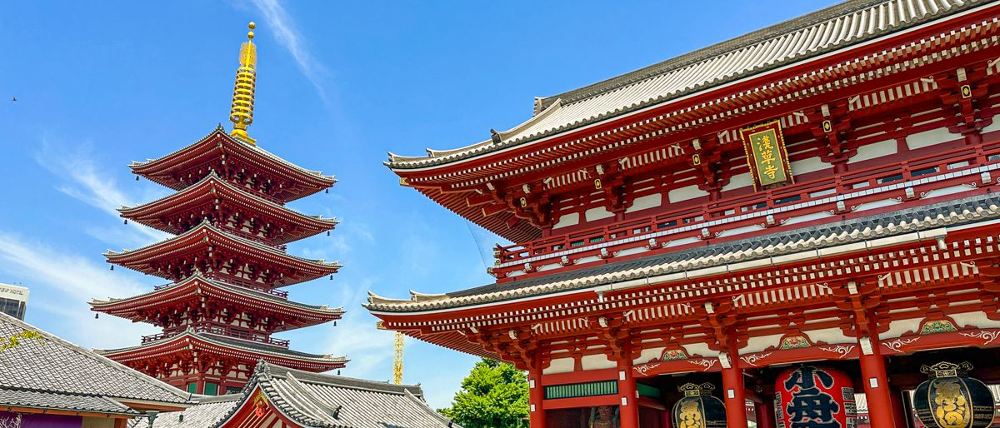

# Tokio / Japón 

## Descripción 
Tokio es una metrópolis vibrante que mezcla tradición y futurismo.

## Recomendación 
Imprescindibles: el templo Senso-ji en Asakusa (tradición), el cruce de Shibuya (modernidad), la vista desde el Tokyo Skytree, y la cultura pop en Akihabara. Visita el santuario Meiji Jingu y pasea por el moderno barrio de Harajuku.

## Imagen de Tokio
 

## Información 
Tokio, capital de Japón, es la mayor área metropolitana del mundo (casi 40 millones de habitantes) y el centro político, económico y cultural del país. Situada en la isla de Honshu, fusiona tecnología de vanguardia y rascacielos con templos tradicionales, ofreciendo una experiencia única de modernidad y tradición. Es un paraíso gastronómico, con transporte eficiente y barrios diversos como Shibuya, Shinjuku y Akihabara.